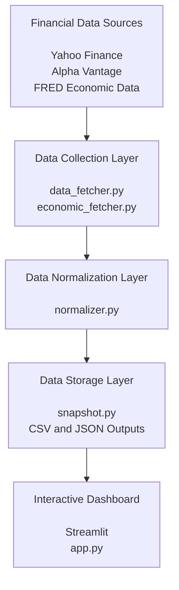

# Finance API Project

## Overview

This project demonstrates a financial data pipeline built with Python. The pipeline connects to multiple financial data APIs, collects market and economic information, standardizes the data format, and exports financial snapshots in JSON and CSV formats.

The project integrates the following data sources:

- FRED API (Federal Reserve Economic Data)
- Yahoo Finance API
- Alpha Vantage API

The goal of this project is to create a reusable workflow for collecting, processing, and organizing financial data from different sources.

---

## Features

- Connects to multiple financial APIs
- Uses environment variables to securely manage API keys
- Retrieves stock market and economic indicators
- Converts different data sources into a unified schema
- Generates standardized financial snapshots
- Exports processed data into JSON and CSV files

---

## System Architecture

The project follows a modular financial data pipeline architecture. Financial data is collected from multiple APIs, normalized into a common schema, stored in structured formats, and visualized through an interactive Streamlit dashboard.



### Data Pipeline Overview

1. **Data Collection**
   - Retrieves stock market data from Yahoo Finance and Alpha Vantage.
   - Retrieves macroeconomic indicators from FRED.

2. **Data Normalization**
   - Converts different data sources into a consistent schema.
   - Ensures financial and economic data can be analyzed together.

3. **Data Storage**
   - Exports normalized data into CSV and JSON formats.

4. **Dashboard Visualization**
   - Provides interactive company comparison, historical analysis, benchmark comparison, and economic indicator visualization.

## Project Structure

```text
finance-api-project/
│
├── main.py
├── snapshot.py
├── normalizer.py
├── requirements.txt
├── financial_snapshot.json
├── financial_snapshot.csv
├── .gitignore
└── README.md
```


---

## Data Sources

### Yahoo Finance

Yahoo Finance is used to collect company-level market information.

The project retrieves:

- Current stock price
- Previous closing price
- Market capitalization
- 52-week high price
- 52-week low price

Example company:

- Apple Inc. (AAPL)

---

### FRED API

FRED (Federal Reserve Economic Data) provides economic indicators.

The project retrieves:

- Gross Domestic Product (GDP)
- Consumer Price Index (CPI)

---

### Alpha Vantage API

Alpha Vantage provides financial market API connectivity for retrieving financial data.

---

## Data Standardization

Since different APIs return data in different formats, this project converts all collected information into a common schema.

The standardized schema includes:

| Field | Description |
|------|-------------|
| data_source | Source of the data |
| timestamp | Time when the data was collected |
| symbol | Stock ticker symbol |
| metric_name | Name of the financial metric |
| metric_value | Value of the metric |
| units | Measurement unit |
| frequency | Data frequency |

Example standardized record:

```json
{
    "data_source": "Yahoo Finance",
    "timestamp": "2026-08-02T15:41:50",
    "symbol": "AAPL",
    "metric_name": "current_price",
    "metric_value": 308.91,
    "units": "USD",
    "frequency": "daily"
}
